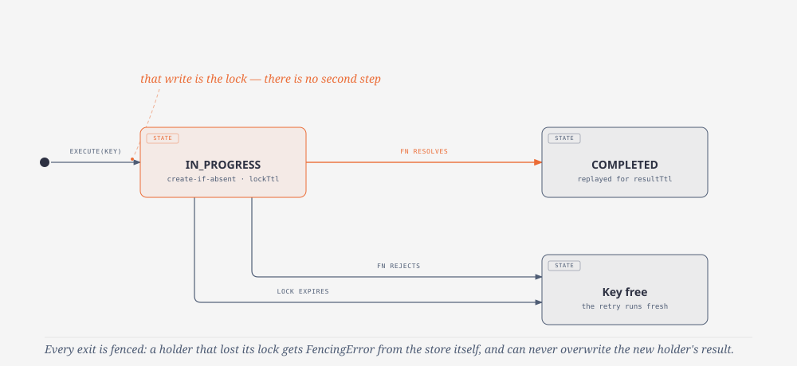

# Core semantics

The reference for how `Idempotency` behaves in the corners. Everything here
is enforced by the unit suite and, for storage behavior, by the shared
contract suite against real servers.

## The state machine

<picture>
  <source media="(prefers-color-scheme: dark)" srcset="assets/atomic-write-lock-dark.svg">
  
</picture>

- The `IN_PROGRESS` record is written atomically (create-if-absent) before
  `fn` runs. The atomic write *is* the lock.
- Every acquisition issues a unique **fencing token**. `complete`, `release`
  and `extend` are validated against it *inside the storage* — a holder that
  lost its lock gets `FencingError` and can never overwrite a newer
  execution. This is what makes long GC pauses and expired locks safe.
- The diagram shows the default. With `persistFailures: true`, a rejection
  transitions to `FAILED` instead of deleting the record: the error is
  serialized and replayed on later calls, so the key is not free again.

### The execution context

The object form of the input also takes `resultTtl`, overriding the
instance replay window for that call:

```ts
await idempotency.execute(
  { key: req.headers['idempotency-key'], payload: req.body, resultTtl: '1h' },
  () => createPayment(req.body)
)
```

A per-route or per-operation window is a property of the call. Expressing
it by building a second `Idempotency` around the same storage costs an
engine per request and duplicates whatever state the engine holds.

Your function receives `ctx`:

| Field | Meaning |
|---|---|
| `key` | The (uncomposed) idempotency key |
| `replayed` | Always `false` inside `fn` — the function only runs on fresh executions |
| `signal` | An `AbortSignal` (reserved for future cancellation semantics) |
| `extend(ttl?)` | Heartbeat: pushes the lock expiry forward (`lockTtl` when omitted). Long-running functions call it periodically instead of sizing a worst-case `lockTtl` up front |
| `doNotStore()` | Opts this execution out of storage: the outcome reaches this caller, the record is released, and the next call with the same key runs fresh. Concurrent callers stay protected by the lock while it runs; only the replay window is given up. It also overrides `persistFailures` for that run |

`doNotStore()` is how a caller says "this outcome is not replayable" without
losing the exactly-once guarantee for callers racing it — the HTTP adapters
use it for responses that cannot be cached (binary, oversized, 5xx), and
business code can use it for results that go stale immediately.

## Durations

Numbers are milliseconds. Strings take a unit suffix: `ms`, `s`, `m`, `h`,
`d` — `'500ms'`, `'30s'`, `'1.5s'`, `'10m'`, `'24h'`, `'7d'`. Zero and
negative values are rejected, as is any positive value that rounds down to
zero milliseconds (`0.4`, `'0.4ms'`): a zero TTL would expire the record the
instant it was written.

## Result serialization

The default codec is JSON with two deliberate hardenings:

- A **top-level `undefined` result** round-trips through a tombstone that
  can never collide with the string `'undefined'`.
- Values JSON would silently drop or mangle **fail loudly** with
  `SerializationError` instead: functions, symbols, `bigint`, non-finite
  numbers (`NaN`, `Infinity`), *nested* `undefined` and circular references.
  A stored result that differs from what the function returned would be a
  silent correctness bug.

If serialization fails after your function succeeded, the record is
released (retries allowed) and the `SerializationError` surfaces — the
result is never half-stored. Need richer types? Pass any `{ encode, decode }`
pair as `codec` (superjson, msgpack).

**Persisted failures go through the same codec.** The engine serializes the
error into a plain shape (`name`, `message`, `stack`, `properties`, `cause`)
and hands *that* to `codec.encode`, so a codec that encrypts at rest covers
error text, stacks and error properties too — not just results. With the
default codec the bytes are plain JSON, unchanged from what earlier versions
wrote. Two paths never throw over a failure the caller is already handling:
a codec that cannot encode the error stores a marker instead, and a record
the codec cannot read back replays as an `Error` carrying the raw text.

## Payload fingerprints and derived keys

`hash = sha256(canonicalize(payload))`, where `canonicalize` is:

- **Type-tagged** — `1`, `'1'`, `true`, `null`, `[1]` and `{ '0': 1 }` all
  hash differently.
- **Order-independent for objects, order-preserving for arrays.**
- **Machine- and locale-independent** — keys sort by code unit, numbers
  normalize `-0`, dates hash as ISO instants, binary views hash as bytes.
- **Prototype-pollution safe** — only own enumerable keys are read; an own
  `__proto__` key is treated as plain data.
- **Loud on ambiguity** — functions, symbols, `Map`/`Set`/`RegExp` and
  circular payloads throw instead of hashing to a colliding representation.

`ignoreFields`/`pickFields` take dot-separated paths (array indices are path
segments too) and are mutually exclusive. Fingerprints are compared in
constant time.

Validation semantics: a record stored *with* a fingerprint can only be
touched by calls carrying the same fingerprint, and a record stored
*without* one only by calls without a payload — any mismatch, including
against an in-flight execution, throws `IdempotencyKeyReuseError`.

When the input has a `payload` but no `key`, the hash becomes the key
(opt-in, for callers with no client-supplied key). The explicit key remains
the primary mechanism: two legitimately identical requests are still
different intents.

## The wait policy

With `onConflict: 'wait'`, a caller that finds the key in progress:

1. Re-reads the record and returns/throws as soon as it is terminal.
2. Sleeps with exponential backoff (25ms doubling toward 1s, capped by the
   remaining `waitTimeout`). Storages that implement the optional
   `waitForChange(key, timeoutMs)` cut the sleep short on change
   notifications — the Redis adapter uses keyspace events; correctness
   never depends on the notification arriving. That subscription outlives
   its last waiter by a few seconds on purpose, so consecutive polls reuse
   it instead of paying a subscribe/unsubscribe round-trip each time; it is
   dropped after the grace period, and immediately on `close()`. A channel that throws,
   rejects or hands back something that is not a promise falls back to the
   plain sleep and reports itself once per wait as a process warning.
3. If the record disappears (the holder failed or its lock expired), the
   waiter **takes over**: it attempts a fresh acquisition and executes.
4. `WaitTimeoutError` when `waitTimeout` elapses first.

The fingerprint is re-checked on every poll, not just at acquisition: a
holder's lock can expire mid-wait and another payload take the key over,
and that outcome is not the waiter's to replay. It gets
`IdempotencyKeyReuseError`, exactly as if it had arrived second.

## Failure replay fidelity

With `persistFailures: true`, a replayed failure is a *reconstruction*:
`name`, `message`, `stack`, own enumerable properties (`code`,
`statusCode`, `details`, ...) and the `cause` chain (depth-capped) are
preserved; properties that do not survive JSON are dropped rather than
allowed to mask the original failure. `instanceof` your custom error class
does **not** survive — check `error.code`/fields on replay, the same
discipline quayside applies to its own error taxonomy.

## Key hygiene

`namespace` and key are percent-encoded *segments*: a client-supplied key
containing the separator cannot address another namespace (`pay` +
`x:y` and `pay:x` + `y` are different records). The composed key is capped
at `maxKeyLength` (default 512) and rejected on overflow — never truncated,
because truncation aliases two keys into one record. Payload-derived keys
are hex hashes and always fit.

The overflow raises `IdempotencyKeyInvalidError` (`IDEMPOTENCY_KEY_INVALID`),
not a `TypeError`: the offending value is data, usually straight from a
client header, so it carries a code and the HTTP adapters answer `400`.
Percent-encoding counts toward the cap, so a key of multibyte characters can
overflow well before 512 of them. `TypeError` is kept for genuine misuse of
the API — a non-string key, an empty key, `ignoreFields` together with
`pickFields`.

## Events reference

Every event carries `{ type, key, namespace?, correlationId, timestamp }`.
The `correlationId` is stable across all events of one `execute` call.

| Type | Emitted when |
|---|---|
| `acquired` | The call won the lock and will run the function |
| `completed` | The result was stored; the call returns fresh |
| `replayed` | A stored outcome (result or persisted failure) was served |
| `conflict` | The key was already in progress (before rejecting or waiting) |
| `failed` | The function failed, the result was unstorable, or the completion write failed |
| `expired-recovery` | Reserved: acquisition over an expired record (not detectable through the storage contract today) |
| `storage-bypass` | `onStorageError: 'open'` ran an execution without the guarantee |

`metrics` receives the same events through named methods (`onAcquired`,
`onReplayed`, ...). Listener exceptions never alter execution semantics:
they surface as process warnings instead of failing the operation.

## Storage errors

Any storage failure surfaces as `StorageUnavailableError` with the driver
error as `cause` (fail-closed, default) unless `onStorageError: 'open'`
accepted the trade-off. Two subtleties:

- If the **completion write** fails after your function ran, fail-closed
  throws (the caller cannot know the result was registered) and fail-open
  returns the value while emitting `storage-bypass`.
- `FencingError` passes through untouched: it means the execution outlived
  its lock and a newer holder owns the key now — the stored outcome is the
  newer holder's, and this caller's work was discarded.
